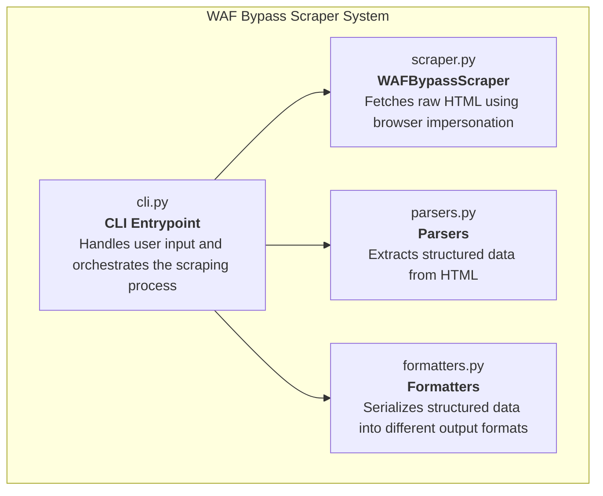
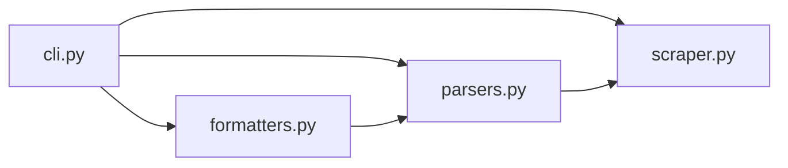
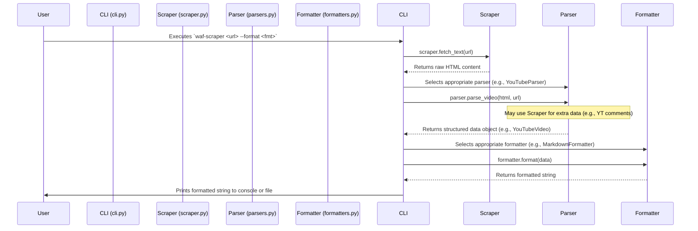
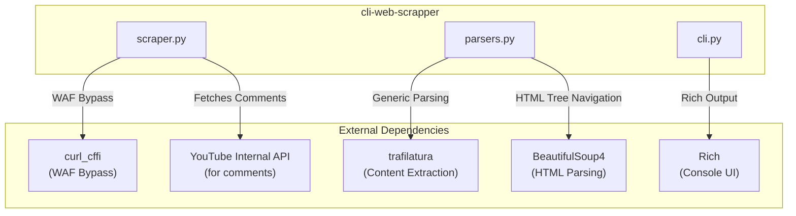

# Architecture Blueprint: `cli-web-scrapper`

**Last Updated:** 2025-11-23

This document outlines the software architecture of the `cli-web-scrapper`, a Python command-line tool for scraping web content.

## 1. Overview

The `cli-web-scrapper` is a Python-based command-line tool designed to scrape web content from various sources, including sites protected by Web Application Firewalls (WAFs). It can intelligently parse content from specific platforms like Reddit and YouTube, as well as generic web pages. The scraped data can be formatted into multiple output formats like JSON, Markdown, plain text, or a rich, colorized console view.

The architecture is modular, separating concerns into distinct layers for fetching, parsing, and formatting content. This design allows for easy extension to support new websites or output formats.

## 2. Major Components

The application is composed of four primary modules, each with a specific responsibility.

-   **`waf_bypass_scraper/cli.py`**: The main entry point for the command-line interface. It uses `argparse` to handle user arguments (URL, output format, etc.). It orchestrates the entire scraping process by selecting the appropriate parser and formatter based on the user's request.
-   **`waf_bypass_scraper/scraper.py`**: Contains the `WAFBypassScraper` class. This is the core component responsible for fetching web content. It uses the `curl_cffi` library to impersonate a real web browser, allowing it to bypass many anti-bot and WAF protections.
-   **`waf_bypass_scraper/parsers.py`**: This module defines the logic for parsing raw HTML into structured data. It includes specialized parsers (`RedditParser`, `YouTubeParser`) for specific sites and a generic parser (`TrafilaturaParser`) for all other pages. It uses data classes (`RedditThread`, `YouTubeVideo`, etc.) to hold the extracted information.
-   **`waf_bypass_scraper/formatters.py`**: This module is responsible for converting the structured data objects created by the parsers into the desired output format. It contains different formatter classes (`RichFormatter`, `JSONFormatter`, `MarkdownFormatter`, `PlainTextFormatter`).

## 3. Module Dependencies

The modules are loosely coupled, with `cli.py` acting as the central coordinator.

-   **`cli.py`** depends on all other major modules to perform its function.
-   **`parsers.py`** has a dependency on `scraper.py` because the `YouTubeParser` needs to make additional API calls via the scraper to fetch comments.
-   **`formatters.py`** depends on the data classes defined in `parsers.py` to understand the structure of the data it needs to format.
-   **`scraper.py`** is self-contained and has no dependencies on other project modules.

## 4. Data Flow

The data flow follows a clear, linear process from user input to final output.

**Steps:**
1.  The user runs the script from the command line, providing a URL and an optional output format.
2.  The `scrape_url` function in `cli.py` initializes the `WAFBypassScraper`.
3.  The scraper's `fetch_text()` method is called to retrieve the raw HTML of the target URL, using `curl_cffi` to bypass protections.
4.  `cli.py` inspects the URL (`is_reddit_url`, `is_youtube_url`) to determine which parser to use.
5.  The chosen parser (e.g., `YouTubeParser`) is instantiated with the HTML and processes it, extracting relevant information like title, author, and content into a structured data class (e.g., `YouTubeVideo`).
6.  For YouTube, the `YouTubeParser` may re-use the `scraper` instance to make secondary API calls to fetch comments.
7.  `cli.py` then selects the formatter class corresponding to the user's requested `output_format`.
8.  The formatter's `format()` method is called with the structured data object.
9.  The formatter returns a final, formatted string (e.g., a Markdown document or a JSON object).
10. `cli.py` prints the result to standard output or writes it to a file specified by the user.

## 5. Integration Points

The application integrates with several external libraries and a web API to achieve its functionality.

-   **`curl_cffi`**: The cornerstone of the `WAFBypassScraper`. It's used to make HTTP requests that impersonate a real browser's TLS fingerprint, which is critical for accessing sites behind Cloudflare and other bot-detection services.
-   **`trafilatura`**: Used by `TrafilaturaParser` to intelligently extract the main content body from generic web pages, stripping away boilerplate like ads, headers, and footers.
-   **`BeautifulSoup4`**: The primary tool used within the `RedditParser` and `YouTubeParser` to navigate and search the HTML DOM tree using CSS selectors.
-   **`Rich`**: Used by `RichFormatter` to produce beautifully formatted and colorized output directly in the terminal.
-   **YouTube Internal API**: The `YouTubeParser` makes POST requests to an endpoint (`/youtubei/v1/next`) to dynamically load and parse video comments, which are not present in the initial page HTML.

## 6. Architecture Patterns & Design Decisions

-   **Strategy Pattern**: The application makes excellent use of the Strategy pattern for both parsing and formatting.
    -   **Parsing Strategy**: The `cli.py` module selects a `Parser` object (`RedditParser`, `YouTubeParser`, `TrafilaturaParser`) at runtime based on the URL. This decouples the main application logic from the specific details of how any given site is parsed.
    -   **Formatting Strategy**: Similarly, `cli.py` selects a `Formatter` object (`JSONFormatter`, `MarkdownFormatter`, etc.) based on the `--output-format` argument. This allows the same scraped data to be presented in multiple ways without changing the core parsing or scraping logic.

-   **Layered Architecture**: The system is organized into logical layers, promoting separation of concerns and maintainability.
    1.  **Presentation Layer (`cli.py`)**: Interacts with the user.
    2.  **Orchestration/Service Layer (`cli.py` - `scrape_url` function)**: Coordinates the high-level process.
    3.  **Data Access/Fetching Layer (`scraper.py`)**: Handles all network communication.
    4.  **Parsing/Business Logic Layer (`parsers.py`)**: Translates raw data into meaningful, structured information.
    5.  **Serialization Layer (`formatters.py`)**: Converts structured information into various output representations.

-   **Data Transfer Objects (DTOs)**: The use of `@dataclass` classes (`RedditThread`, `YouTubeVideo`, `TrafilaturaContent`) serves to create simple, immutable containers for data. These DTOs act as a clear contract between the Parsing Layer and the Formatting Layer, ensuring that data is passed between them in a consistent and structured manner.

## 7. Architectural Concerns & Areas for Improvement

-   **Extensibility**: Adding a new site requires modifying the `if/elif` chain in `cli.py`. A more scalable approach could use a registration pattern, where parsers can register themselves as handlers for specific domain patterns. This would allow new parsers to be added without modifying the core CLI logic.
-   **Error Handling**: While the top-level `scrape_url` function has a `try...except` block for network errors, the parsers could benefit from more granular error handling. For instance, if a CSS selector for a specific site changes, the parser might fail silently. More specific `try...except` blocks within parsers for critical fields would make the tool more resilient to website updates.
-   **Testing**: The project lacks an automated testing suite. Unit tests for parsers (using saved HTML fixtures) and formatters would be invaluable for preventing regressions, especially when updating a parser to adapt to a website change.
